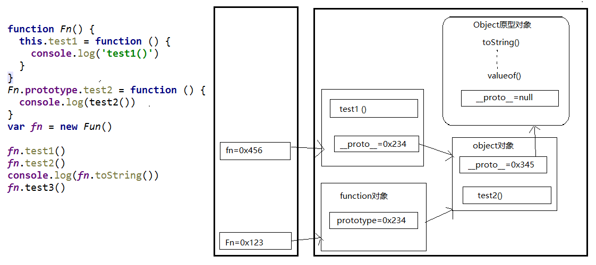

# Prototype 原型
- 所有函数都有一个特别的属性:
  - `prototype` : 显式原型属性
- 所有实例对象都有一个特别的属性:
  - `__proto__` : 隐式原型属性
- 显式原型与隐式原型的关系
  - 函数的prototype: 定义函数时被自动赋值, 值默认为{}, 即用为原型对象
  - 实例对象的__proto__: 在创建实例对象时被自动添加, 并赋值为构造函数的prototype值
  - 原型对象即为当前实例对象的父对象
- 原型链
  - 所有的实例对象都有__proto__属性, 它指向的就是原型对象
  - 这样通过__proto__属性就形成了一个链的结构---->原型链
  - 当查找对象内部的属性/方法时, js引擎自动沿着这个原型链查找
  - 当给对象属性赋值时不会使用原型链, 而只是在当前对象中进行操作
  

	
  